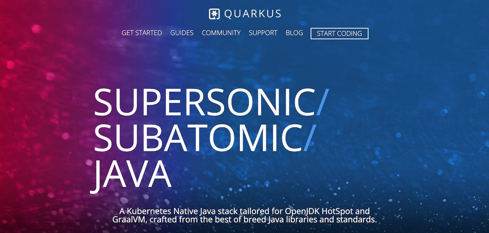
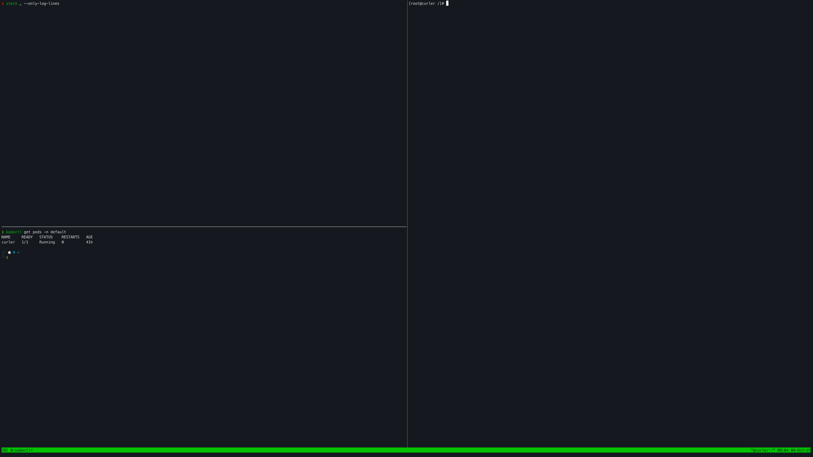
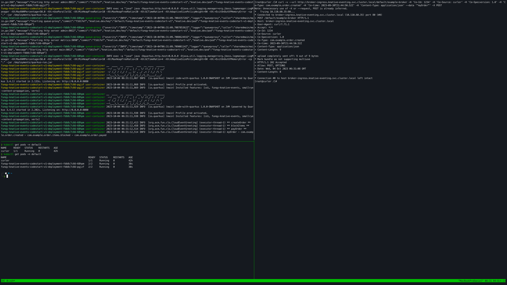

En el mundo de la ingeniería software, la eficiencia y la escalabilidad son fundamentales. Una tecnología que ha 
transformado la forma en que desarrollamos y desplegamos aplicaciones es **Function as a Service** (FAAS), y en este 
artículo, exploraremos cómo **Quarkus** ([aqui](https://www.adictosaltrabajo.com/?s=quarkus) hablamos de más cosas de 
este maravilloso framework) y **Funqy** nos ayudan a los desarrolladores crear aplicaciones más eficientes y escalables.

# Índice de contenidos
+ [1. Introducción](#1-introducción)
+ [2. Entorno](#2-entorno)
+ [3. Funqy Knative Events](#3-funqy-knative-events)
+ [4. Demo](#4-demo)
+ [5. Conclusiones](#5-conclusiones)
+ [6. Referencias](#6-referencias)


# 1. Introducción 
FAAS es un modelo de computación en la nube que permite a los desarrolladores ejecutar funciones de manera 
independiente en respuesta a eventos específicos sin preocuparse por la gestión de servidores subyacentes. En esencia, 
FAAS permite desarrollar aplicaciones sin servidor, donde las funciones se ejecutan de manera escalable y automática en 
la nube, lo que simplifica la implementación y reduce la carga operativa para los desarrolladores. Cada función se 
activa solo cuando se invoca, lo que permite una gestión eficiente de los recursos y una mayor flexibilidad en el 
desarrollo de aplicaciones.

Por otro lado, Knative es una plataforma de código abierto que extiende de Kubernetes para admitir aplicaciones sin 
servidor. Permite a los desarrolladores construir y desplegar aplicaciones sin servidor de manera sencilla, 
automatizando gran parte del trabajo de operación, lo que significa que los desarrolladores pueden centrarse en 
escribir código y no preocuparse por la gestión de la infraestructura. En resumen, es una plataforma que facilita la 
creación de aplicaciones sin servidor en Kubernetes, permitiendo a los desarrolladores ejecutar código en respuesta a 
eventos específicos de manera eficiente y escalable.

Por último, los Cloud Events son un estándar abierto para describir eventos en sistemas distribuidos y entornos en 
la nube. Proporcionan un formato común para representar eventos y metadatos asociados, independientemente de la 
plataforma o proveedor de servicios en la nube. Esto facilita la interoperabilidad y el intercambio de eventos entre 
aplicaciones y servicios en diferentes entornos de la nube.

# 2. Entorno
+ Hardware: MacBook Pro (Intel Core i7, 16 GB DDR4)
+ MacOs Ventura v13.5.2
+ Quarkus v3.4.1
+ kubectl v1.28.2 
+ minikube v1.31.2


# 3. Funqy Knative Events
Vale, vale, pero todo esto que me estás contando como lo hago? Vamos a verlo! En primer lugar tenemos que añadir
la dependecia a nuestro proyecto:
 ```xml
<dependency>
    <groupId>io.quarkus</groupId>
    <artifactId>quarkus-funqy-knative-events</artifactId>
</dependency>
 ```

Después creamos una clase que contenga las funciones que necesitamos para nuestro programa y ver como se van 
ejecutando en nuestro cluster de kubernetes en función del Cloud Event que se publica en el broker. No es necesario
tener todas las funciones en una misma clase, es solo para simplificar el tutorial.

```java
public class CloudEventGreeting {
  @Funq
  @CloudEventMapping(trigger = "com.example.order.created", responseSource = "https://example.com/createOrder", responseType = "com.example.order.items.blocked")
  public String createOrder(String input, @Context CloudEvent cloudEvent) {
    Log.info("** createOrder **");
    return input + " - " + cloudEvent.type();
  }

  @Funq
  @CloudEventMapping(trigger = "com.example.order.items.blocked", responseSource = "https://example.com/blockItems", responseType = "com.example.order.payed")
  public String blockItems(String input, @Context CloudEvent cloudEvent) {
    Log.info("** blockItems **");
    return input + " - " + cloudEvent.type();
  }

  @Funq
  @CloudEventMapping(trigger = "com.example.order.payed")
  public void payOrder(String input, @Context CloudEvent cloudEvent) {
    Log.info("** payOrder **");
    Log.infof("%s - %s", input, cloudEvent.type());
  }
}
```
+ ① Clase para tener trazabilidad de lo que ocurre en las aplicaciones
+ ② CloudEventMapping es una anotocación que nos permite mappear el trigger con el se lanza la función. Si la función
devuelve algo es recomendable poner quien es el emisor de dicha salida y a qué tipo lo quiere mappear. Esto es útil en 
el caso de que queramos concatenar funciones. Esta configuración también se puede hacer por medio de properties de la
siguiente  manera. 
  ```
  quarkus.funqy.knative-events.mapping.{function name}.trigger=com.example.order.created
  quarkus.funqy.knative-events.mapping.{function name}.response-type=com.example.order.items.blocked
  quarkus.funqy.knative-events.mapping.{function name}.response-source=https://example.com/createOrder
  ```
+ ③ Este segundo parámetro, `CloudEvent`, es opcional. Mi recomendación es siempre añadirlo para tener más información
sobre el evento, ya que nos ayudará a tener mayor trazabilidad de este e incluso tomar mejores decisiones técnicas.
  ```java
  public interface CloudEvent {
    String id();
    String specVersion();
    String source();
    String subject();
    OffsetDateTime time();
  }
  ```
  > **¡Importante!** Como se ha dicho en la descripción, los Cloud Events son un estándar y debemos respetar esto.
Os comparto la [documentación oficial](https://github.com/cloudevents/spec/blob/main/cloudevents/spec.md#required-attributes)
para que podáis ver como se estructura un Cloud Event. 

Así de simple es desarrollar una función en Quarkus con Funqy. Antes de comenzar con la parte de Knative, generamos una
imagen Docker de nuestro proyecto y lo subimos al registry. 
```shell
$ quarkus build
$ docker build -f src/main/docker/Dockerfile.jvm -t yourAccountName/image-name .
$ docker push yourAccountName/image-name
```
Ahora tenemos que configurar Knative para que pueda
ejecutar alguna de las funciones desarrolladas en base al evento que llegue el broker, que se encuentra dentro de 
nuestro cluser de Kubernetes.

En primer lugar, vamos a crear el servicio que será el que cree el contenedor
```yaml
# funqy-service.yaml

apiVersion: serving.knative.dev/v1
kind: Service
metadata:
  name: image-name
spec:
  template:
    metadata:
      name: image-name-v1
      annotations:
        autoscaling.knative.dev/target: "1"
    spec:
      containers:
        - image: docker.io/yourAccountName/image-name
```

Despues vamos a crear los triggers que serán las funciones que se levantarán cuando llegue el evento al que están 
suscritas.
```yaml
# create-order-trigger.yaml

apiVersion: eventing.knative.dev/v1
kind: Trigger
metadata:
  name: create-order
spec:
  broker: broker-name
  filter:
    attributes:
      type: com.example.order.created
  subscriber:
    ref:
      apiVersion: serving.knative.dev/v1
      kind: Service
      name: image-name
```

Una vez tengamos los ficheros creados, podemos ejecutar el siguiente comando para aplicar estos cambios en nuestro 
cluser.
```shell
kubectl apply -n default -f src/main/k8s/funqy-service.yaml
kubectl apply -n default -f src/main/k8s/create-order-trigger.yaml
kubectl apply -n default -f src/main/k8s/block-items-trigger.yaml
kubectl apply -n default -f src/main/k8s/pay-order-trigger.yaml
```

# 4. Demo
Ya tenemos todo listo, ahora tenemos que verlo en funcionamiento para validarlo y para ello seguiremos los siguientes 
pasos:
+ Para poder ver los logs de nuestro cluster, vamos a ayudarnos de la herramienta stern para simplificar el proceso 
`$ stern . --only-log-lines`. Ejecutar este comando en una ventana nueva para poder ver los logs cuando ejecutemos el
curl.
+ Necesitamos saber la ip del broker para poder invocar a alguna de las funciones `$ kubectl get broker default -o jsonpath='{.status.address.url}'`.
+ Añadiremos un Pod para poder ejecutar el curl dentro del cluster
  ```yaml
  # curler.yml
      
  apiVersion: v1
  kind: Pod
  metadata:
    labels:
    run: curler
    name: curler
  spec:
    containers:
      - name: curler
      image: fedora:33
      tty: true
  ```
  ```shell
  $ kubectl apply -n default -f src/main/k8s/curler.yaml
  $ kubectl -n default exec -it curler -- /bin/bash
  ```

Una vez ejecutado el último comando, estaremos dentro del cluster. Ahora haremos un curl como el siguiente
```shell
curl -v --url http://broker-ingress.knative-eventing.svc.cluster.local/default/example-broker -H 'Ce-Id: 1234' -H 'Ce-Source: curler' -H 'Ce-Specversion: 1.0' -H 'Ce-Type: com.example.order.created' -H 'Ce-time: 2023-09-30T21:44:50.52Z' -H 'Content-Type: application/json' --data '"myOrder"' -X POST
```

En esta imagen de abajo tengo las ventanas preparadas. Arriba a la izquierda tengo el comando `stern`ejecutándose para
analizar los logs del cluster. Abajo a la izquierda, se puede ver que solo hay un pod corriendo que será desde donde 
se lanza la petición (imaginate que es un microservicio que va a publicar el evento al broker). Y a la derecha, estoy
dentro del pod para ejecutar el `curl`.




Ejecutamos el `curl` y veremos lo siguiente. Arriba izquierda se verá como se crea un pod que contendrá la aplicación y
escribirá los logs según vayan los eventos ejecutando funciones. Y abajo a la izquierda, veremos como hay más pods que
corresponden (a parte del curler) que serán los recientemente creados para poder atender las peticiones del broker.



Si al cabo de un periodo de tiempo (esto es configurable a través de Kubernetes) las funciones no reciben ningún evento,
se ejecutará automática un proceso de desescalado.

# 5. Conclusiones
Hemos aprendido como implementar funciones serverless con Quarkus. Además, se ha enseñado como usar 
Cloud Events para integrarse correctamente con otros sistemas de eventos. Y por último, hemos visto como encadenar
nuestras propias funciones para cumplir con las necesidades de negocio y poder desplegarlas en Knative. 

Con lo rápido que se despligan las aplicaciones y lo optimizado que está Quarkus para Kubernetes, puede resultar una
interesante opción a tener en cuenta según las necesidades que tenga el negocio. Además, se pueden llevar estrategías
para ahorrar costes en los entornos productivos. A veces, tenemos máquinas levantadas todo constantemente cuando el tráfico
a estas es bastante bajo o esporádico. De esta manera, se puede atender a la demanda de los usuarios fácilmente y reduciendo
los costes de infraestructura.

# 6. Referencias
+ https://quarkus.io/guides/
+ https://github.com/cloudevents/spec/blob/main/cloudevents/spec.md#required-attributes